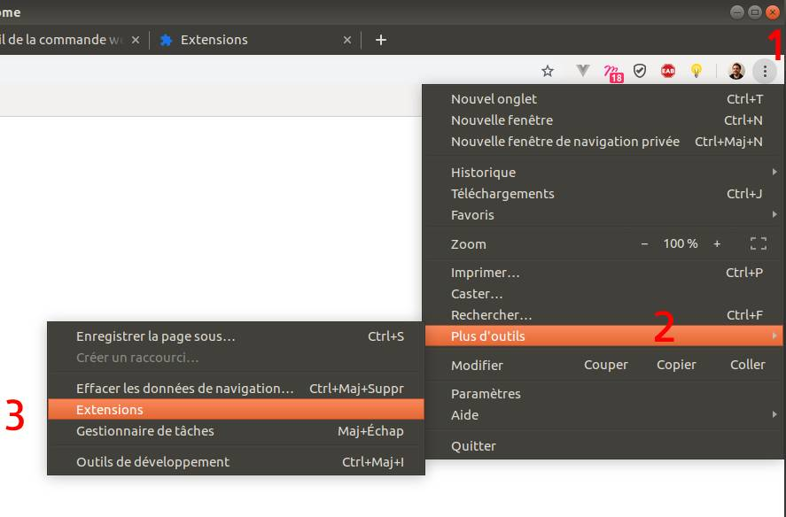
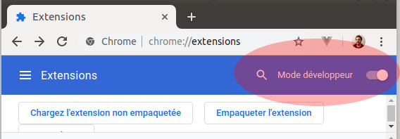
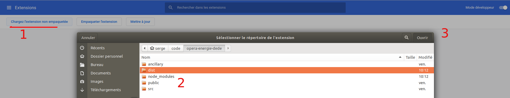
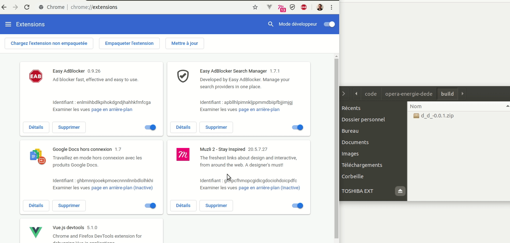
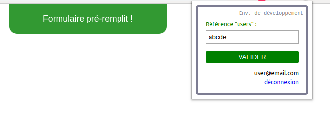
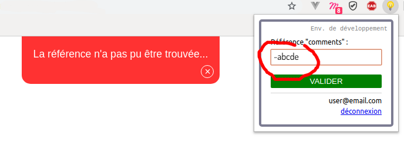

# Dédé

Dédé est une extension web (Chrome uniquement pour l'instant) destinée à pré-remplir des formulaires à l'aide de données fournies par un serveur externe.

C'est également le nom de l'opérette française dans laquelle on retrouve le morceau "Dans la vie faut pas s'en faire".

## Utilisation

### Configuration

La variable `BASE_URL`, correspondant à l'adresse du serveur backend est paramétrable dans le fichier `./.env`.

En environnement de développement, cette variable est définie dans le fichier `./.env.local` ([un backend de test est fourni dans `./ancillary/server/`](#tests)).

### Démarrer le projet

Télécharge les dépendances npm (typiquement à utiliser après un "git clone") et créé un premier build en mode développement :

```sh
npm start
```

#### Installation pour le développement

- Ouvrir la page des extensions de Chrome :



- Passer en mode développeur :



- Ouvrir l'extension non empaquetée :



### Build

Créé le build utilisable comme extension par le navigateur :

```sh
npm run build
```

Cette commande créé ou modifie les deux dossiers de build : `./dist` qui contient le résultat de la compilation de Webpack et `./build` qui contient le zip utilisable "en prod" de l'extension.

#### Installation "en prod" de l'extension sur Chrome

- Ouvrir la page des extensions de Chrome :


- Passer en mode développeur :


- Glisser le zip dans la page de Chrome et désactiver le mode développeur :




### Développement

Compile, lance le watcher de webpack et le serveur backend de test :

```sh
npm run dev
```

## Fonctionnement

### Ajouter une nouvelle source de formulaires

- Trouver un identifiant unique pour différencier ce formulaire des autres déjà configurés.

- Créer un fichier qui contiendra cet identifiant et deux méthodes (le plus simple est de dupliquer le fichier `./src/WebPageForms/forms/template.js` pour avoir la structure).

_À noter_ : Le nom du fichier lui-même n'a pas d'importance du moment qu'il soit unique. Le plus simple est d'utiliser le nom du module, qui est le même que la valeur de l'id.

#### Générateur automatique

Un générateur est disponible pour simplifier le processus de création d'un nouveau type de formulaire.

En ligne de commande, à la racine du projet, taper la commande (remplacer nom_du_module avec l'identifiant choisi) :

```sh
npm run create-form -- --name=nom_du_module
```

Un fichier avec la bonne structure sera créé dans le dossier `./src/WebPageForms/forms/nom_du_module.js`.

#### Contrat à respecter

La forme du module doit être la suivante :

```javascript
export const nom_du_module = {
  id: type('string'),
  isCurrent: type('function'): Boolean,
  fillForm(data): type('function'): Void
}
```

Par exemple :

```javascript
// ./src/WebPageForms/forms/template.js

export const template = {
  id: 'template',

  isCurrent() {
    return false;
  },

  fillForm(data) {
    const champAPreRemplir = document.querySelector('#champ');
    champAPreRemplir.value = data.champ;
  }
};
```

Le nom du module, la propriété `id`, la fontion `isCurrent()` et la fonction `fillForm(data)` sont obligatoires et aucune autre propriété ou fonction ne peut être ajoutée.

_À noter_ fillForm prend une variable en paramètre, elle contiendra les données reçues du backend.

#### Nom du module :

Il s'agit de l'identifiant unique pour ce formulaire. Utiliser la même valeur que l'id.

```javascript
export const template = {
// ...
```

#### Propriété : 'id' :

Il s'agit d'une chaîne de caractères qui sert d'identifiant unique pour ce formulaire. Utiliser la même valeur que le nom du module.

```javascript
{
  id: "template",

  // ...
}
```

#### Fonction d'identification du type de formulaire : 'isCurrent()' :

Cette fonction permettra d'identifier le type de formulaire, elle doit retourner "true" si le formulaire présent sur la page web correspond ou "false" dans le cas contraire.

```javascript
{
  // ...

  isCurrent() {
      // créé un test dont le résultat indiquera
      // si le formulaire sur la page web correspond ou non à ce test.
      return true || false;
  }

  // ...
}
```

#### Fonction de pré-remplissage du formulaire : 'fillForm(data)' :

Créer cette fonction de manière à pré-remplir le formulaire de la page web.

Typiquement vous devez intéragir avec le DOM pour changer les valeurs des différents champs à l'aide des données récupérées du serveur.

Les données reçues sont disponibles dans la variable fournie en paramètre de la fonction (nommé ici "data", pour l'exemple).

```javascript
{
  // ...

  fillForm(data) {
      // sélectionne les champs du formulaire de la page
      // et les hydrate avec les données reçues en paramètre dans 'data'.
      // Ne renvoie rien.
  }
}
```

#### Exemple concret

Imaginons que nous avons deux sources possibles de formulaires, un formulaire de création de compte d'utilisateur et un formulaire pour poster un commentaire sur un blog. Les deux formulaires sont sur deux sites complètement séparés et n'ont aucun rapport entre eux.

1. Première chose, trouver des identifiants uniques : appelons le premier "type" de formulaires `users` et le second `comments`.

2. Il faut donc maintenant créer deux fichiers dans le dossier `./src/WebPageForms/forms/`.

Cela donnera `./src/WebPageForms/forms/users.js` et `./src/WebPageForms/forms/comment.js`.

3. Chacun de ces fichiers doit exporter un objet (ce que l'on appelle ici un module) qui correspond à l'identifiant unique que nous avons choisi.

dans le fichier `users.js` nous aurons donc :

```javascript
export const users = {};
```

et dans le fichier `comments.js` :

```javascript
export const comments = {};
```

4. Nous pouvons maintenant compléter nos modules avec la propriété `id` et les fonctions `isCurrent()` et `fillForm(data)` :

```javascript
// ./src/WebPageForms/forms/users.js
export const users = {
  id: 'users',
  isCurrent() {},
  fillForm(data) {}
};
```

```javascript
// ./src/WebPageForms/forms/comments.js
export const comments = {
  id: 'comments',
  isCurrent() {},
  fillForm(data) {}
};
```

5. Écrire la fonction `isCurrent()`

- Pour `users` :

Imaginons que pour remplir ce formulaire de création de compte nous devions naviguer sur l'url "http://www.mon-site/creation-compte".

Cela semble être un moyen sûr d'identifier le formulaire à remplir. En effet à chaque fois que l'utilisateur devra pré-remplir un formulaire de type `users`, il devra se rendre sur cette page.

Nous pouvons donc nous servir de cette information :

```javascript
// ./src/WebPageForms/forms/users.js
export const users = {
  // ...

  isCurrent() {
    const url = window.location.href;

    if (url === 'http://www.mon-site/creation-compte') {
      return true;
    } else {
      return false;
    }
  }

  // ...
};
```

- Pour `comments` :

Malheureusement sur le second site, on peut poster un commentaire sur plusieurs pages. On ne peut donc pas se servir de l'url dans ce cas.

Par chance les formulaires de création de commentaire ont tous l'id `#commentaire`. C'est cette information que l'on va viser pour déterminer si on est bien sur une page de type `comments` :

```javascript
// ./src/WebPageForms/forms/comments.js
export const comments = {
  // ...

  isCurrent() {
    const formId = document.querySelector('#commentaire');

    if (formId !== null) {
      return true;
    } else {
      return false;
    }
  }

  // ...
};
```

6. Écrire la fonction `fillForm(data)`

La procédure est la même pour `users` et pour `comments`, voyons simplement comment pré-remplir un formulaire de type `users` :

Nous savons par exemple que le formulaire contient un champ "pseudo" et un champ "email" à pré-remplir.

La variable `data` passée en paramètre contient les données relatives, appelées disons `username` et `email`.

```javascript
// ./src/WebPageForms/forms/users.js
export const users = {
  // ...

  fillForm(data) {
    // récupération des input à pré-remplir depuis le DOM de la page web
    const pseudoElement = document.querySelector("input[name='pseudo']");
    const emailElement = document.querySelector("input[name='email']");

    // récupération des données relatives depuis 'data'
    const username = data.username;
    const email = data.email;

    // il ne reste plus qu'à pré-remplir les champs
    pseudoElement.value = username;
    emailElement.value = email;
  }
};
```

### Tests

<a name="tests"></a>

Un serveur PHP (Symfony 4) est configuré pour réaliser des tests fonctionnels. Il sert de backend et permet de tester l'identification ainsi que la récupération de fausses données.

Pour le lancer, ainsi qu'une page web contenant un formulaire de test, se placer à la racine du projet et taper `npm run dev`.

Pour le lancer tout seul : `npm run server`.

Le serveur écoutera alors sur "http://127.0.0.1:8000" (configuration par défaut de la variable `BASE_URL` du fichier `./.env.local`).

#### Authentification

Identifiants de test configurés par défaut :

- E-mail : `user@email.com`
- Mot de passe : `password`

Si besoin ces identifiants sont modifiables côté back : `./ancillary/server/.env`

(Côté front, pour modifier l'autocomplétion "de confort", changer la variable `USER` du fichier `./.env.local`).

#### Récupération de données

Par défaut, le serveur répondra à n'importe quelle référence de plus de trois caractères dans la requête.



En environnement de développement, on peut simuler une mauvaise requête en préfixant la référence par le symbole `-` :



### Système de notifications

Le script injecté côté page web contient un système de notification pour donner du feedback à l'utlisateur final de l'extension.

Objet "notification" :

```javascript
notification = {
  type: String,
  message: String
  [, msBeforeAutoHide]: Number
};
```

La propriété optionnelle "msBeforeAutoHide", si elle est déclarée, permet de faire disparaître automatiquement la notification au bout du nombre de millisecondes passé en valeur. Le bouton sous forme de croix pour "fermer" la notification ne sera alors pas visible.

Les différents types et messages sont disponibles sous forme de constantes dans l'objet `NOTIFICATIONS` du fichier `./src/scripts/constants.js`

Pour créer une notification, côté extension ou côté page web, importer la fonction `notify` du fichier `./src/scripts/notify.js` et lui passer un objet "notification" :

```javascript
const notification = {
  status: 'success',
  message: 'Ceci est une notification',
  msBeforeAutoHide: 3000
};

notify(notification);
```

La notification apparaîtra automatiquement, remplaçant éventuellement une notification déjà présente.

### Pour info : script de contenu et script d'arrière-plan

#### Généralités

Cette extension est composée de deux parties :

1. La première partie correspond au script 'principal', c'est le coeur de l'extension.
   Son point d'entrée est le fichier `./src/main_extension.js`. Il s'agit d'un "script d'arrière-plan" (_background script_).

1. La seconde partie correspond au script injecté dans la page web externe qui contient le formulaire à pré-remplir.
   Son point d'entrée est le fichier `./src/main_webPage.js`. Il s'agit d'un "script de contenu" (_content script_).

#### Système de messaging

[Les "Web Extensions" utilisent un système de messaging pour permettre la communication entre les scripts de contenu et les scripts d'arrière-plan.](https://developer.mozilla.org/fr/docs/Mozilla/Add-ons/WebExtensions/Content_scripts#Communicating_with_background_scripts)

C'est notament ce système de messaging qui est utilisé quand l'extension demande à la page web quel est son 'webPageForm'.

Chacune de ces parties tourne dans un processus différent, a son propre DOM, son propre storage, etc.

Chacune possède donc son propre "state" (géré ici par VueX) et l'accès au store de l'autre partie ne peut pas se faire directement ([on peut utiliser le système de messaging pour cela](https://developer.mozilla.org/fr/docs/Mozilla/Add-ons/WebExtensions/Content_scripts#Communicating_with_background_scripts)).

Les fonctions relatives à ce système de "messaging" sont dans le fichier `./src/scripts/messaging.js`.

#### Les outils

##### Gulp

Pour pouvoir récupérer dynamiquement les types de formulaires ajoutés par le développeur, les fichiers contenus dans le dossier `./src/WebPageForms/forms` sont concaténés par Gulp en un seul fichier (`dist/formsLists.js`) **avant** que ce dernier ne soit compilé par Webpack.

En test manuel (`npm run dev`), c'est Gulp qui ouvre le navigateur avec un formulaire HTML de test.

C'est également Gulp qui gère le générateur automatique de fichier pour configurer les types de formulaire (tâche `scaffoldNewForm` du fichier `./gulpfile.js`).

##### Webpack

Le script relatif à la page web (le script de contenu) est injecté dans la page web de l'onglet courant à l'exécution du script d'arrière plan quand l'utilisateur clique sur l'icone de l'extension, il n'est jamais importé directement par le script principal et doit donc être compilé à part.

Le fichier `./webpack.config.js` contient donc deux configurations, une pour la partie extension (extensionConfig) et une pour la partie page web (webPageConfig).

Webpack s'occupe de compiler les templates vue, transpiler scss en css, transpiler ES6+ en ES5 (minifié pour la prod), injecter le script d'arrière plan dans le html de la popup.

##### web-ext

Il s'agit d'un outil de Mozilla qui permet de créer le build de l'extension sous forme de zip.
